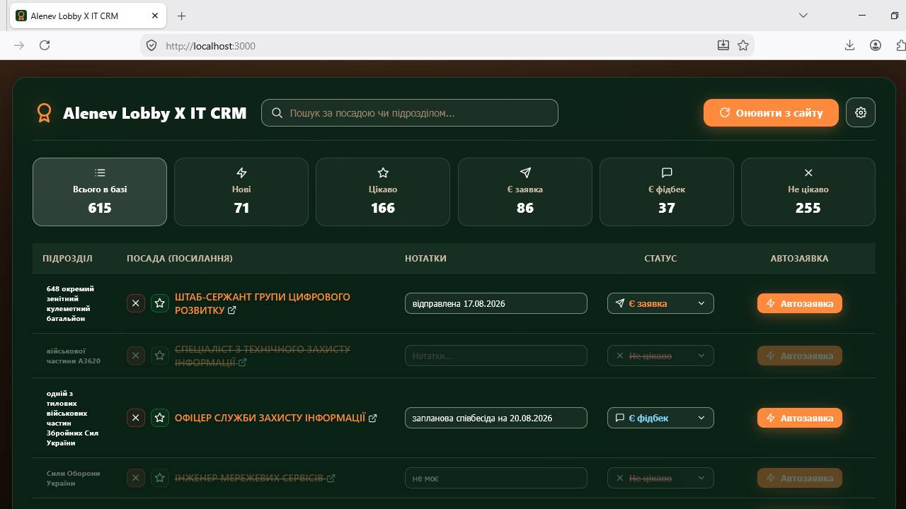
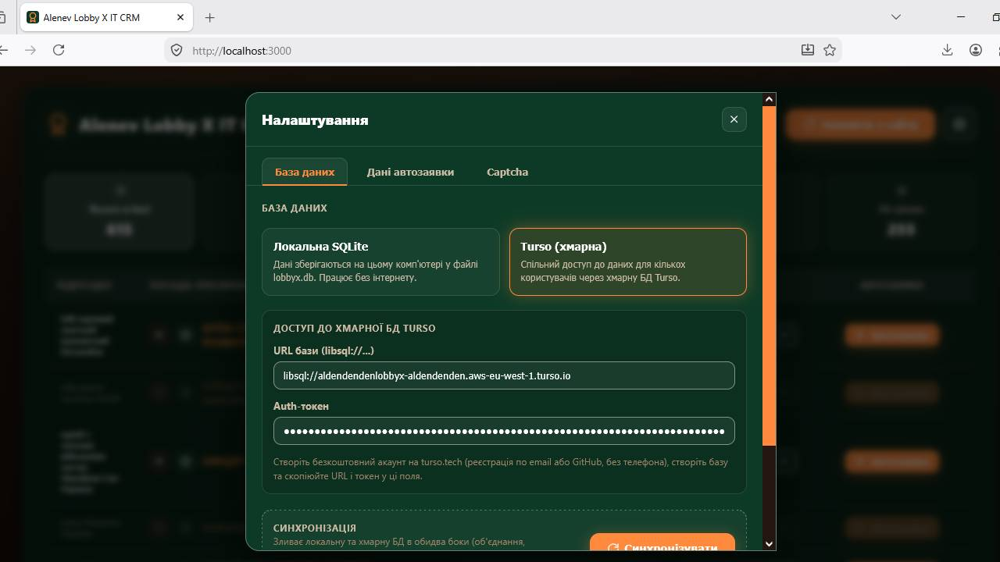
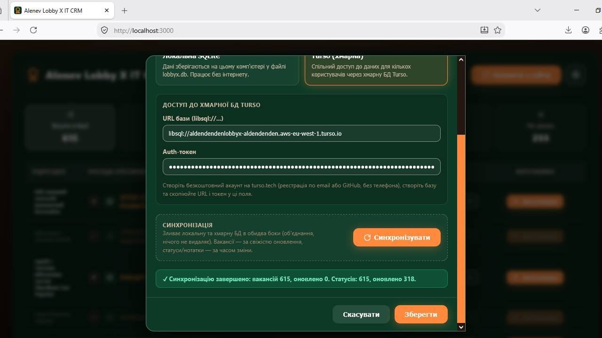
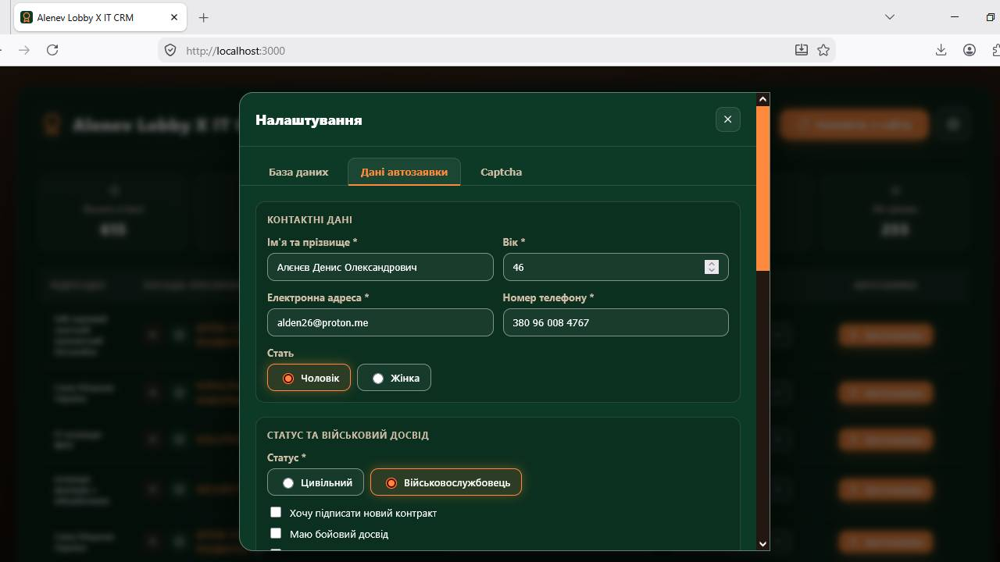
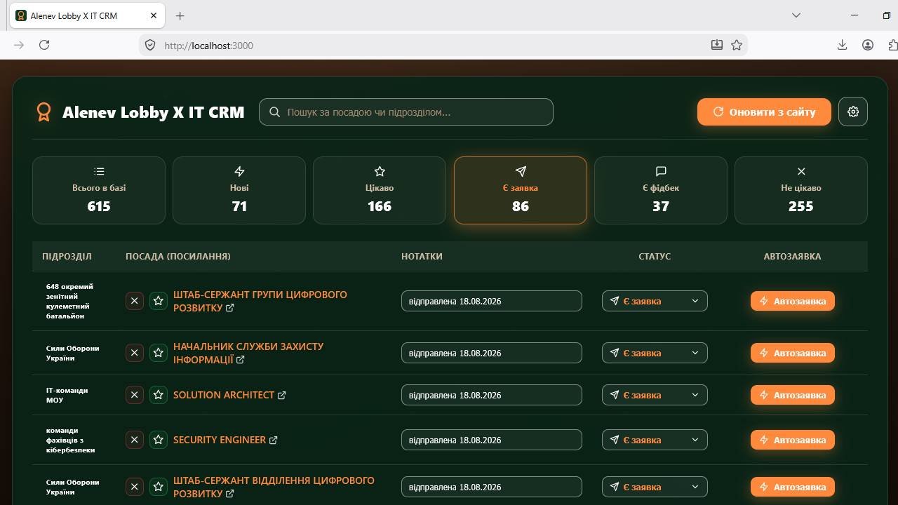

# Alenev Lobby X IT CRM

Автономна CRM-система для обробки вакансій із сайту **Lobby X** (lobbyx.army / lobbyx.org). Програма сама збирає IT-вакансії зі всіх підрозділів, дозволяє відмічати статус опрацювання кожної, вести нотатки, фільтрувати та шукати — усе в одному локальному (або хмарному) сховищі. Функція 'автозаявка' дозволяє отримувати вакансію у окремому відкритому вікні браузера із заповненою формою подачі заявки даними із єдиного базового шаблона з налаштувань системи (аналогічна заявці форма яка заповнюється індивідуально). Потрібно тільки пройти капчу й натиснути кнопку відправки заявки — статус оновиться автоматично. Мінімум часу для максимальної ефективності.   



---

## Зміст

- [Можливості](#можливості)
- [Технічний стек](#технічний-стек)
- [Переваги й особливості](#переваги-й-особливості)
- [Структура проєкту](#структура-проєкту)
- [Системні вимоги](#системні-вимоги)
- [Швидкий старт (локально, без інтернету)](#швидкий-старт-локально-без-інтернету)
- [Налаштування хмарної бази Turso](#налаштування-хмарної-бази-turso)
- [Синхронізація локальної та хмарної баз](#синхронізація-локальної-та-хмарної-баз)
- [Автозаявка](#автозаявка)
- [Початок використання](#початок-використання)
- [API-ендпоінти](#api-ендпоінти)
- [Поширені питання](#поширені-питання)
- [Безпека](#безпека)
- [Ліцензія](#ліцензія)

---

## Можливості

- **Автозбір вакансій** — парсинг IT-вакансій усіх підрозділів Lobby X через Puppeteer + Cheerio однією кнопкою.
- **5 статусів опрацювання**: `Нова`, `Цікаво`, `Є заявка`, `Є фідбек`, `Не цікаво`.
- **Нотатки** до кожної вакансії (зберігаються в окремій таблиці і не затираються при оновленні з сайту).
- **Пошук та фільтри** — миттєва фільтрація за статусом і повнотекстовий пошук по назві/підрозділу.
- **Автозаявка** — кнопка біля кожної вакансії: відкриває форму заявки Lobby X та автоматично заповнює її даними з вашого шаблону в налаштуваннях (включно з файлами CV). Після відправки заявки статус вакансії **автоматично змінюється на «Є заявка»**.
- **Два бекенди даних**:
  - локальна **SQLite** (файл `lobbyx.db`, працює без інтернету);
  - хмарна **Turso** (libSQL) — спільний доступ для кількох користувачів.
- **Синхронізація баз** — двостороннє злиття локальної та хмарної БД без втрати даних.
- **Резервне копіювання** — автоматичний бекап `lobbyx_backup.db` перед кожним оновленням.
- **Автоматична міграція** старого `db.json` → SQLite.
- **Запуск одним файлом** `СТАРТ.bat` на Windows.

## Технічний стек

| Рівень | Технологія |
|---|---|
| Frontend | React 19, Vite 8 |
| Backend | Node.js, Express 5 |
| Парсинг | Puppeteer 25, Cheerio |
| Локальна БД | SQLite (вбудований `node:sqlite`, без окремих залежностей) |
| Хмарна БД | Turso (libSQL) через `@libsql/client` |
| Мова | JavaScript (CommonJS на сервері, ES Modules у клієнті) |
| Порт | `3000` |

## Переваги й особливості

- **Повністю автономний** — сервер + збірка фронтенду + БД на одній машині, запуск без інтернету (у локальному режимі).
- **Дані користувача не губляться**: статуси й нотатки лежать в окремій таблиці `vacancy_meta`, тому повторний парсинг лише оновлює назви/підрозділи вакансій, не торкаючись ваших відміток.
- **Безкоштовна хмара** — Turso має щедрий безкоштовний тариф (реєстрація по email або GitHub, без телефону й картки).
- **Синхронізація без конфліктів** — об'єднання даних з обох боків:
  - назва/підрозділ вакансії — перемагає запис із новішим часом збору (`scraped_at`);
  - статус/нотатки — перемагає запис із новішим часом зміни (`updated_at`);
  - нічого не видаляється — принцип «union».
- **Вбудований HTTP-клієнт до хмари без VPN/проксі** — стандартні HTTPS-запити.


## Структура проєкту

```
├── server.js            # Express-сервер: API, парсинг, роздача фронтенду
├── db.js                # Двосторонній доступ до БД (SQLite + Turso) та sync
├── settings.js          # Налаштування (режим БД, Turso, дані автозаявки) у settings.json
├── autofill.js          # Автозаповнення форми заявки на Lobby X через Puppeteer
├── autofill_files/      # Завантажені файли CV/додаткові (у .gitignore)
├── settings.json        # Секретні налаштування (у .gitignore!)
├── СТАРТ.bat            # Автозапуск на Windows: збірка + сервер + браузер
├── client/
│   ├── src/
│   │   ├── App.jsx      # Головний компонент інтерфейсу
│   │   ├── api.js       # Клієнт REST-API
│   │   └── components/  # StatsBar, VacancyTable, SettingsModal, AutofillTab, StatusSelect...
│   └── index.html
└── screenshots/         # Скриншоти для README
```

## Системні вимоги

- **Node.js 22.5+** (рекомендовано 24.x LTS) — потрібен вбудований модуль `node:sqlite`.
- **Windows / macOS / Linux**.
- Для хмарного режиму — акаунт Turso і доступ в інтернет.
- Для автопарсингу Lobby X — вільний порт і можливість HTTPS-запитів.

## Швидкий старт (локально, без інтернету)

### 1. Встановлення

```bash
git clone <репозиторій>
cd LobbyX_UI

# встановити залежності (сервер + клієнт):
npm install:all

# або вручну:
# npm install && cd client && npm install
```

### 2. Збірка фронтенду

```bash
npm run build
```

### 3. Запуск сервера

```bash
npm start
# або: node server.js
```

Відкрийте **http://localhost:3000** — при першому запуску сервер сам створить файли БД і перенесе дані зі старого `db.json`, якщо він є.

### Альтернатива для Windows

Просто запустіть **`СТАРТ.bat`** — він перевірить/встановить залежності, збере фронтенд, запустить сервер в окремому вікні та відкриє браузер.

## Налаштування хмарної бази Turso

> Цей крок необов'язковий — потрібен лише якщо хочете спільний доступ до даних з інших пристроїв/користувачів.

1. Створіть безкоштовний акаунт на **https://turso.tech** (по email або GitHub).
2. У панелі створіть базу даних (наприклад, `lobbyx`).
3. Скопіюйте з панелі:
   - **URL** (формат `libsql://<назва>-<префікс>.turso.io`);
   - **Auth token** (довгий рядок `eyJ...`).
4. У CRM натисніть шестірню **настройок** у шапці.
5. Оберіть картку **«Turso (хмарна)»**, вставте URL і токен, натисніть **«Зберегти»**.



Сервер перевірить підключення, створить таблиці в хмарі та переключиться на неї. Тепер CRM читає/пише у хмарну базу — дані доступні з будь-якого пристрою, де вказано ті самі URL і токен.

### Повернення до локального режиму

Так само у шестірні виберіть **«Локальна SQLite»** → «Зберегти». Файли `lobbyx.db` створюються автоматично, якщо їх немає.

## Синхронізація локальної та хмарної баз

Кнопка **«Синхронізувати»** у модальному вікні налаштувань зливає дві бази в обидва боки:

- **Вакансії**: об'єднання всіх URL; назва/підрозділ беруться з запису з новішим `scraped_at`.
- **Статуси та нотатки**: перемагає запис із новішим `updated_at`; якщо час однаковий — перевагу має статус, відмінний від `Нове`.
- **Нічого не видаляється** — це об'єднання (union), тож втрата даних виключена.
- Після завершення показується звіт: скільки вакансій і статусів усього та скільки оновлено.



Типовий сценарій: працюєте вдома на локальній БД → натискаєте «Синхронізувати» → пізніше на іншому пристрої теж натискаєте «Синхронізувати» — і обидві бази мають однакові дані.

## Автозаявка

Автозаявка дозволяє **відправити заявку на вакансію Lobby X одним кліком**: програма сама відкриває сторінку вакансії, відкриває форму подачі заявки й заповнює її даними з вашого шаблону, збереженого в налаштуваннях.

### Як це працює

1. Кнопка **«Автозаявка»** є біля кожної вакансії в таблиці.
2. При кліку сервер запускає **видиме вікно Chrome** через Puppeteer і відкриває сторінку вакансії.
3. Програма натискає кнопку відкриття форми (`#open-modal.add-vacancy_btn`), дочекавшись завантаження, **автоматично заповнює форму**:
   - текстові поля (ім'я, вік, email, телефон, опис досвіду);
   - радіокнопки (стать, статус) та чекбокси (бойовий досвід, СЗЧ, навчання тощо);
   - випадаючий список «Звання»;
   - **прикріплює файли** (CV/резюме та додатковий файл);
   - вмикає згоду на обробку персональних даних (Політика конфіденційності).
4. Вікно **залишається відкритим** — користувач лише проходить reCAPTCHA і натискає **«Відправити»**.
   > reCAPTCHA **неможливо** пройти автоматично — це єдина дія, яку виконує людина.

### Шаблон даних у налаштуваннях

У модальному вікні налаштувань (шестірня в шапці) є окрема вкладка **«Дані автозаявки»** — набір полів, що повторює форму заявки Lobby X:

- **Контактні дані**: ім'я та прізвище, стать, вік, email, телефон.
- **Статус та військовий досвід**: статус (Цивільний / Військовослужбовець), чекбокси (новий контракт, бойовий досвід, СЗЧ, військове навчання), звання.
- **Резюме**: текст опису досвіду та мотивації, файл з CV/резюме, додатковий файл.
- **Згоди**: розсилка від Lobby X (необов'язково) та Політика конфіденційності (обов'язково).



### Завантаження файлів

- Файли вибираються через звичайний діалог вибору файлів (підтримуються `.pdf, .doc, .docx, .pages, .jpg, .jpeg, .png, .rtf`, до 10 МБ).
- Завантажений файл одразу зберігається на сервері у папку **`autofill_files/`**, а в налаштуваннях лишається лише його ім'я.
- Кнопка **«Видалити»** поруч із завантаженим файлом відв'язує його від шаблону.
- Після заповнення натисніть **«Зберегти дані автозаявки»** — над кнопкою з'явиться підтвердження «✓ Дані автозаявки збережено».

### Типовий сценарій використання

1. Відкрийте **Налаштування** → вкладка **«Дані автозаявки»**.
2. Заповніть шаблон (контакти, досвід, резюме, файли) і натисніть **«Зберегти дані автозаявки»**.
3. Поверніться до таблиці вакансій і натисніть **«Автозаявка»** біля потрібної вакансії.
4. У відкритому вікні Chrome перевірте заповнену форму, пройдіть капчу та натисніть **«Відправити»**.
5. Після відправки статус вакансії **змінюється автоматично** на «Є заявка».

> **Примітка про безпеку:** папка `autofill_files/` з вашими документами додана до `.gitignore` — вона ніколи не потрапляє в репозиторій.

## Початок використання

1. **Оновіть дані**: кнопка **«Оновити з сайту»** запускає парсинг усіх вакансій IT зі всіх підрозділів Lobby X. Нові вакансії додаються зі статусом `Нова`, існуючі оновлюються, а ваші статуси й нотатки не зачіпаються.
2. **Відмічайте статуси**: у колонці «Статус» виберіть потрібний стан із випадаючого списку.
3. **Додавайте нотатки**: колонка «Нотатки» зберігає введений текст автоматично.
4. **Фільтруйте**: картки-фільтри зверху (Всі / Зацікавився / Подав заявку / Зворотний зв'язок / Ігнорую) та пошук по назві/підрозділу.
5. **Ігноровані вакансії** автоматично зменшують яскравість (35% прозорість), щоб не відволікати.
6. **Подавайте автозаявки**: заповніть шаблон у «Налаштуваннях → Дані автозаявки» і натискайте «Автозаявка» біля потрібної вакансії (деталі — у розділі [Автозаявка](#автозаявка)).



## API-ендпоінти

| Метод | Шлях | Опис |
|---|---|---|
| GET | `/api/vacancies` | Список вакансій зі статусами й нотатками |
| POST | `/api/vacancies/status` | Змінити статус (`{ url, status }`) |
| POST | `/api/vacancies/notes` | Зберегти нотатки (`{ url, notes }`) |
| POST | `/api/scrape` | Запустити парсинг сайту |
| GET | `/api/settings` | Отримати налаштування |
| POST | `/api/settings` | Зберегти налаштування (режим + Turso) |
| POST | `/api/settings/autofill` | Зберегти дані автозаявки |
| POST | `/api/autofill/files` | Завантажити файл для автозаявки (multipart, поле `file`) |
| POST | `/api/autofill` | Запустити автозаявку (`{ url }`) |
| POST | `/api/sync` | Двостороння синхронізація локальної та хмарної БД |

Дозволені значення статусу: `new`, `interested`, `applied`, `feedback`, `ignored`.

## Поширені питання

**Помилка підключення до Turso при збереженні налаштувань?**
Перевірте URL (формат `libsql://...turso.io`) і токен — вони вказані в панелі Turso. Помилка показується у модальному вікні, поточний режим БД не змінюється.

**Хочу скинути все налаштування?**
Видаліть `settings.json` у корені — сервер створить його заново з локальним режимом за замовчуванням.

**Загубив(ла) дані?**
Локальна БД перед кожним парсингом копіюється у `lobbyx_backup.db`. Крім того, синхронізація ніколи не видаляє дані.

**Порт 3000 зайнятий?**
Закрийте старий процес: `taskkill /f /im node.exe` (Windows) або `СТАРТ.bat` робить це автоматично.

**Автозаявка не відкривається або не заповнює форму?**
Спершу переконайтеся, що шаблон заповнено й збережено (вкладка «Дані автозаявки»). Помилка показується під кнопкою «Автозаявка» в таблиці. Якщо вікно Chrome не з'являється — перевірте, що сервер працює й має доступ до встановленого Chrome (Puppeteer). Якщо Lobby X змінить розмітку форми, автозаповнення може не спрацювати — оновіть програму або повідомте про проблему.

**Чому заявку не надсилає сама програма?**
Форма захищена reCAPTCHA, яку неможливо обійти автоматично. Програма заповнює все, окрім капчі — її проходить користувач і натискає «Відправити». Після відправки статус вакансії змінюється автоматично.

**Автозаявка не змінює статус вакансії?**
Статус змінюється автоматично після відправки форми. Система перехоплює POST-запит форми та встановлює статус «Є заявка». Якщо статус не змінився — перевірте логи в `debug.log`.  

## Безпека

- `settings.json` містить **auth-токен** Turso — він доданий до `.gitignore`, тож ніколи не потрапить у репозиторій. Не видаляйте його з `.gitignore`.
- Сервер локальний і не має автентифікації — не виставляйте порт 3000 у публічний інтернет без додаткового захисту (VPN/reverse-proxy).

## Ліцензія

Всім хто 'живе' в IT й цифровій трансформації України присвячується.
